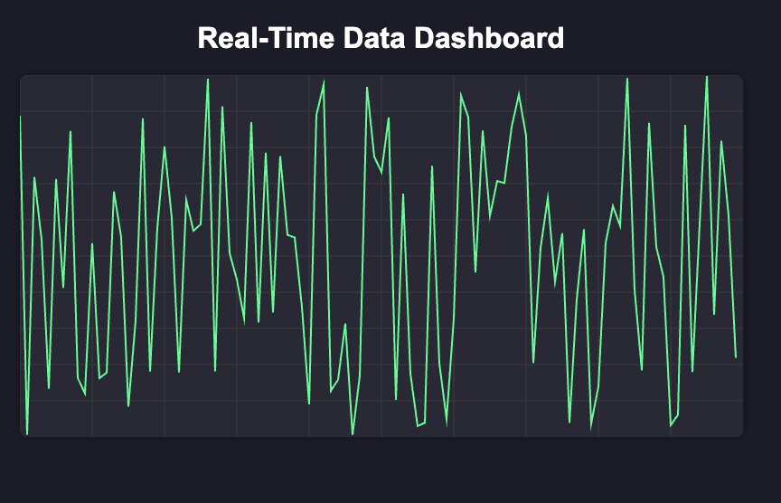

This project is a browser-based real-time dashboard that visualizes streaming data (e.g., CPU usage, stock prices, or IoT sensor data) using the HTML5 Canvas API. It leverages Canvas for efficient rendering of thousands of dynamic data points.

Technologies Used:

-   HTML5 Canvas API
-   Vanilla JavaScript (ES6+)
-   WebSocket (for live data)
-   CSS

    
